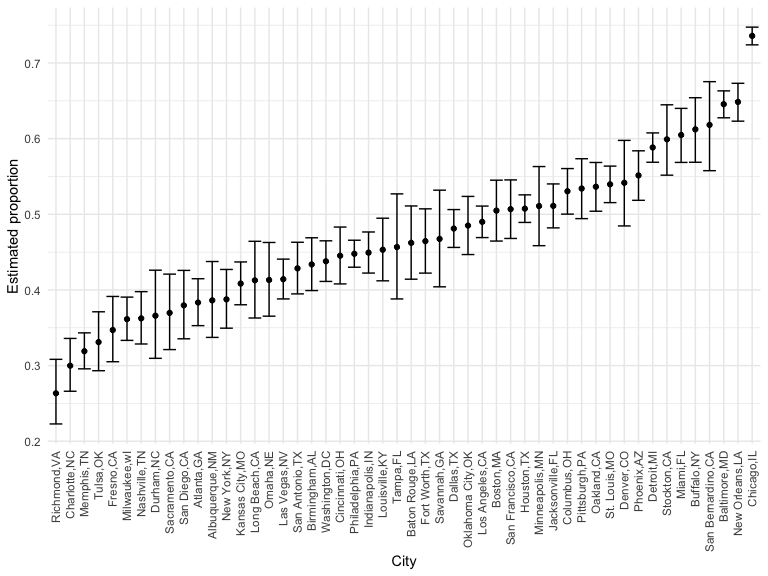

p8105_hw5_fm2751
================
Fengyi Ma
2022-11-16

## Problem 0

## Problem 1

The code chunk below imports the data in individual spreadsheets
contained in `./data/zip_data/`. To do this, I create a dataframe that
includes the list of all files in that directory and the complete path
to each file. As a next step, I `map` over paths and import data using
the `read_csv` function. Finally, I `unnest` the result of `map`.

``` r
full_df = 
  tibble(
    files = list.files("data/zip_data/"),
    path = str_c("data/zip_data/", files)
  ) %>% 
  mutate(data = map(path, read_csv)) %>% 
  unnest()
```

The result of the previous code chunk isn’t tidy – data are wide rather
than long, and some important variables are included as parts of others.
The code chunk below tides the data using string manipulations on the
file, converting from wide to long, and selecting relevant variables.

``` r
tidy_df = 
  full_df %>% 
  mutate(
    files = str_replace(files, ".csv", ""),
    group = str_sub(files, 1, 3)) %>% 
  pivot_longer(
    week_1:week_8,
    names_to = "week",
    values_to = "outcome",
    names_prefix = "week_") %>% 
  mutate(week = as.numeric(week)) %>% 
  select(group, subj = files, week, outcome)
```

Finally, the code chunk below creates a plot showing individual data,
faceted by group.

``` r
tidy_df %>% 
  ggplot(aes(x = week, y = outcome, group = subj, color = group)) + 
  geom_point() + 
  geom_path() + 
  facet_grid(~group)
```


This plot suggests high within-subject correlation – subjects who start
above average end up above average, and those that start below average
end up below average. Subjects in the control group generally don’t
change over time, but those in the experiment group increase their
outcome in a roughly linear way.

## Problem 2

### Describe the raw data

``` r
homicide = read_csv("./data/homicide-data.csv")

summary(homicide)
```

    ##      uid            reported_date       victim_last        victim_first      
    ##  Length:52179       Min.   : 20070101   Length:52179       Length:52179      
    ##  Class :character   1st Qu.: 20100318   Class :character   Class :character  
    ##  Mode  :character   Median : 20121216   Mode  :character   Mode  :character  
    ##                     Mean   : 20130899                                        
    ##                     3rd Qu.: 20150911                                        
    ##                     Max.   :201511105                                        
    ##                                                                              
    ##  victim_race         victim_age         victim_sex            city          
    ##  Length:52179       Length:52179       Length:52179       Length:52179      
    ##  Class :character   Class :character   Class :character   Class :character  
    ##  Mode  :character   Mode  :character   Mode  :character   Mode  :character  
    ##                                                                             
    ##                                                                             
    ##                                                                             
    ##                                                                             
    ##     state                lat             lon          disposition       
    ##  Length:52179       Min.   :25.73   Min.   :-122.51   Length:52179      
    ##  Class :character   1st Qu.:33.77   1st Qu.: -96.00   Class :character  
    ##  Mode  :character   Median :38.52   Median : -87.71   Mode  :character  
    ##                     Mean   :37.03   Mean   : -91.47                     
    ##                     3rd Qu.:40.03   3rd Qu.: -81.76                     
    ##                     Max.   :45.05   Max.   : -71.01                     
    ##                     NA's   :60      NA's   :60

This raw dataset contains 52179 observations and 12 variables, they are
’uid, reported_date, victim_last, victim_first, victim_race, victim_age,
victim_sex, city, state, lat, lon, disposition. Data on homicides were
collected in 50 large U.S. cities. The earliest reported date is
2007/01/01.

### Create variables

``` r
homicide_df = 
  homicide %>% 
  janitor::clean_names() %>%
  mutate(
    city_state = str_c(city, ",", state),
    resolution = case_when(
      disposition == "Closed without arrest" ~ "unsolved",
      disposition == "Open/No arrest" ~ "unsolved",
      disposition == "Closed by arrest" ~ "solved"
    )) %>% 
  relocate(city_state) %>% 
  select(city_state, resolution) 

# Find a strange input for "Tulsa,AL", remove
homicide_df = 
homicide_df %>% 
  filter(city_state != "Tulsa,AL")

head(homicide_df, 10)
```

    ## # A tibble: 10 × 2
    ##    city_state     resolution
    ##    <chr>          <chr>     
    ##  1 Albuquerque,NM unsolved  
    ##  2 Albuquerque,NM solved    
    ##  3 Albuquerque,NM unsolved  
    ##  4 Albuquerque,NM solved    
    ##  5 Albuquerque,NM unsolved  
    ##  6 Albuquerque,NM unsolved  
    ##  7 Albuquerque,NM solved    
    ##  8 Albuquerque,NM solved    
    ##  9 Albuquerque,NM unsolved  
    ## 10 Albuquerque,NM unsolved

### Summarize

``` r
homicide_summary =
  homicide_df %>% 
  group_by(city_state) %>% 
  summarize(
    homicide_total = n(),
    homicide_unsolved = sum(resolution == "unsolved")
    )

homicide_summary %>% 
  knitr::kable()
```

| city_state        | homicide_total | homicide_unsolved |
|:------------------|---------------:|------------------:|
| Albuquerque,NM    |            378 |               146 |
| Atlanta,GA        |            973 |               373 |
| Baltimore,MD      |           2827 |              1825 |
| Baton Rouge,LA    |            424 |               196 |
| Birmingham,AL     |            800 |               347 |
| Boston,MA         |            614 |               310 |
| Buffalo,NY        |            521 |               319 |
| Charlotte,NC      |            687 |               206 |
| Chicago,IL        |           5535 |              4073 |
| Cincinnati,OH     |            694 |               309 |
| Columbus,OH       |           1084 |               575 |
| Dallas,TX         |           1567 |               754 |
| Denver,CO         |            312 |               169 |
| Detroit,MI        |           2519 |              1482 |
| Durham,NC         |            276 |               101 |
| Fort Worth,TX     |            549 |               255 |
| Fresno,CA         |            487 |               169 |
| Houston,TX        |           2942 |              1493 |
| Indianapolis,IN   |           1322 |               594 |
| Jacksonville,FL   |           1168 |               597 |
| Kansas City,MO    |           1190 |               486 |
| Las Vegas,NV      |           1381 |               572 |
| Long Beach,CA     |            378 |               156 |
| Los Angeles,CA    |           2257 |              1106 |
| Louisville,KY     |            576 |               261 |
| Memphis,TN        |           1514 |               483 |
| Miami,FL          |            744 |               450 |
| Milwaukee,wI      |           1115 |               403 |
| Minneapolis,MN    |            366 |               187 |
| Nashville,TN      |            767 |               278 |
| New Orleans,LA    |           1434 |               930 |
| New York,NY       |            627 |               243 |
| Oakland,CA        |            947 |               508 |
| Oklahoma City,OK  |            672 |               326 |
| Omaha,NE          |            409 |               169 |
| Philadelphia,PA   |           3037 |              1360 |
| Phoenix,AZ        |            914 |               504 |
| Pittsburgh,PA     |            631 |               337 |
| Richmond,VA       |            429 |               113 |
| Sacramento,CA     |            376 |               139 |
| San Antonio,TX    |            833 |               357 |
| San Bernardino,CA |            275 |               170 |
| San Diego,CA      |            461 |               175 |
| San Francisco,CA  |            663 |               336 |
| Savannah,GA       |            246 |               115 |
| St. Louis,MO      |           1677 |               905 |
| Stockton,CA       |            444 |               266 |
| Tampa,FL          |            208 |                95 |
| Tulsa,OK          |            583 |               193 |
| Washington,DC     |           1345 |               589 |

### For the city of Baltimore, MD

``` r
# create and save as object
Baltimore = 
  prop.test(
    homicide_summary %>% 
      filter(city_state == "Baltimore,MD") %>% pull(homicide_unsolved),
    homicide_summary %>% 
      filter(city_state == "Baltimore,MD") %>% pull(homicide_total)
  ) 

#pull the estimates
broom::tidy(Baltimore) %>% 
  knitr::kable()
```

|  estimate | statistic | p.value | parameter |  conf.low | conf.high | method                                               | alternative |
|----------:|----------:|--------:|----------:|----------:|----------:|:-----------------------------------------------------|:------------|
| 0.6455607 |   239.011 |       0 |         1 | 0.6275625 | 0.6631599 | 1-sample proportions test with continuity correction | two.sided   |

### For each of the cities

``` r
All_city =
  homicide_summary %>% 
  mutate(
    homi_test = map2(.x = homicide_unsolved, .y = homicide_total, ~prop.test(x = .x, n = .y)),
    homi_tidy = map(.x = homi_test, ~broom::tidy(.x))
  ) %>% 
  select(city_state, homi_tidy) %>% 
  unnest(homi_tidy) %>% 
  select(city_state, estimate, starts_with("conf"))

All_city %>% 
  knitr::kable()
```

| city_state        |  estimate |  conf.low | conf.high |
|:------------------|----------:|----------:|----------:|
| Albuquerque,NM    | 0.3862434 | 0.3372604 | 0.4375766 |
| Atlanta,GA        | 0.3833505 | 0.3528119 | 0.4148219 |
| Baltimore,MD      | 0.6455607 | 0.6275625 | 0.6631599 |
| Baton Rouge,LA    | 0.4622642 | 0.4141987 | 0.5110240 |
| Birmingham,AL     | 0.4337500 | 0.3991889 | 0.4689557 |
| Boston,MA         | 0.5048860 | 0.4646219 | 0.5450881 |
| Buffalo,NY        | 0.6122841 | 0.5687990 | 0.6540879 |
| Charlotte,NC      | 0.2998544 | 0.2660820 | 0.3358999 |
| Chicago,IL        | 0.7358627 | 0.7239959 | 0.7473998 |
| Cincinnati,OH     | 0.4452450 | 0.4079606 | 0.4831439 |
| Columbus,OH       | 0.5304428 | 0.5002167 | 0.5604506 |
| Dallas,TX         | 0.4811742 | 0.4561942 | 0.5062475 |
| Denver,CO         | 0.5416667 | 0.4846098 | 0.5976807 |
| Detroit,MI        | 0.5883287 | 0.5687903 | 0.6075953 |
| Durham,NC         | 0.3659420 | 0.3095874 | 0.4260936 |
| Fort Worth,TX     | 0.4644809 | 0.4222542 | 0.5072119 |
| Fresno,CA         | 0.3470226 | 0.3051013 | 0.3913963 |
| Houston,TX        | 0.5074779 | 0.4892447 | 0.5256914 |
| Indianapolis,IN   | 0.4493192 | 0.4223156 | 0.4766207 |
| Jacksonville,FL   | 0.5111301 | 0.4820460 | 0.5401402 |
| Kansas City,MO    | 0.4084034 | 0.3803996 | 0.4370054 |
| Las Vegas,NV      | 0.4141926 | 0.3881284 | 0.4407395 |
| Long Beach,CA     | 0.4126984 | 0.3629026 | 0.4642973 |
| Los Angeles,CA    | 0.4900310 | 0.4692208 | 0.5108754 |
| Louisville,KY     | 0.4531250 | 0.4120609 | 0.4948235 |
| Memphis,TN        | 0.3190225 | 0.2957047 | 0.3432691 |
| Miami,FL          | 0.6048387 | 0.5685783 | 0.6400015 |
| Milwaukee,wI      | 0.3614350 | 0.3333172 | 0.3905194 |
| Minneapolis,MN    | 0.5109290 | 0.4585150 | 0.5631099 |
| Nashville,TN      | 0.3624511 | 0.3285592 | 0.3977401 |
| New Orleans,LA    | 0.6485356 | 0.6231048 | 0.6731615 |
| New York,NY       | 0.3875598 | 0.3494421 | 0.4270755 |
| Oakland,CA        | 0.5364308 | 0.5040588 | 0.5685037 |
| Oklahoma City,OK  | 0.4851190 | 0.4467861 | 0.5236245 |
| Omaha,NE          | 0.4132029 | 0.3653146 | 0.4627477 |
| Philadelphia,PA   | 0.4478103 | 0.4300380 | 0.4657157 |
| Phoenix,AZ        | 0.5514223 | 0.5184825 | 0.5839244 |
| Pittsburgh,PA     | 0.5340729 | 0.4942706 | 0.5734545 |
| Richmond,VA       | 0.2634033 | 0.2228571 | 0.3082658 |
| Sacramento,CA     | 0.3696809 | 0.3211559 | 0.4209131 |
| San Antonio,TX    | 0.4285714 | 0.3947772 | 0.4630331 |
| San Bernardino,CA | 0.6181818 | 0.5576628 | 0.6753422 |
| San Diego,CA      | 0.3796095 | 0.3354259 | 0.4258315 |
| San Francisco,CA  | 0.5067873 | 0.4680516 | 0.5454433 |
| Savannah,GA       | 0.4674797 | 0.4041252 | 0.5318665 |
| St. Louis,MO      | 0.5396541 | 0.5154369 | 0.5636879 |
| Stockton,CA       | 0.5990991 | 0.5517145 | 0.6447418 |
| Tampa,FL          | 0.4567308 | 0.3881009 | 0.5269851 |
| Tulsa,OK          | 0.3310463 | 0.2932349 | 0.3711192 |
| Washington,DC     | 0.4379182 | 0.4112495 | 0.4649455 |

### Create a plot

``` r
homi_plot =
  All_city %>% 
  mutate(
    city_state = fct_reorder(city_state, estimate)) %>% 
  ggplot(aes(x = city_state, y = estimate)) +
  geom_point() +
  geom_errorbar(aes(ymin = conf.low, ymax = conf.high)) +
  labs(y = "Estimated proportion", x = "City") +
  theme(axis.text.x = element_text(angle = 90, vjust = 0.5, hjust = 1)
  )
  
homi_plot
```



## Problem 3

### Generate 5000 datasets
